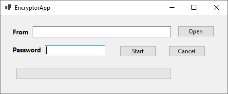

#### Вам нужно написать программу, которая шифрует/дешифрует файлы с помощью оператора XOR. Вы вводите файл, либо вводя его имя в текстовое поле, либо нажимая кнопку «Файл» и выбирая его в появившемся диалоговом окне.

- При нажатии на кнопку запуска программа запускается. Процесс шифрования и дешифрования должен отображаться с помощью индикатора выполнения. Пользователь может отменить процесс. При этом проделанная работа также должна вернуться в прежнее состояние. (например: если половина файла зашифрована, при отмене файл должен вернуться в свое предыдущее состояние и отразиться в индикаторе выполнения (панель выполнения должна идти .)).

- Пример программы:

