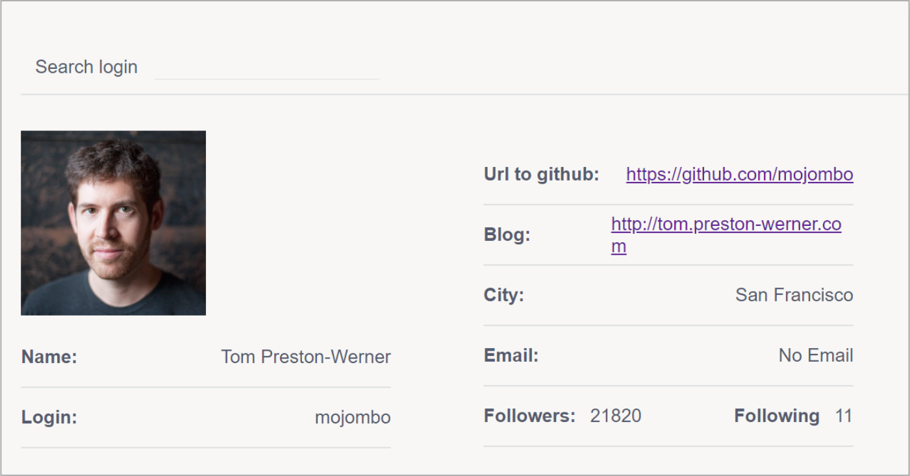

## Необходимо создать сайт, на котором можно узнать  информацию о пользователе GitHub. 

Для этого используйте  GitHub API https://api.github.com/users/. Он возвращает  информацию о пользователе по его логину. То есть чтобы получить нужные данные используйте такой запрос  https://api.github.com/users/userLogin. UserLogin должен  быть логином необходимого пользователя.  Должна быть возможность указать логин пользователя. При нажатии кнопки поиска должен выполниться  запрос к API и отобразится такая информация на экране:
- Фото;
- Имя;
- Логин;
- Ссылка на GitHub пользователя;
- Ссылка на блог;
- Город;
- Почта;
- Количество подписчиков и подписок.

### Если какой-то информации о пользователе нет, необходимо указать, что таких данных нет.

