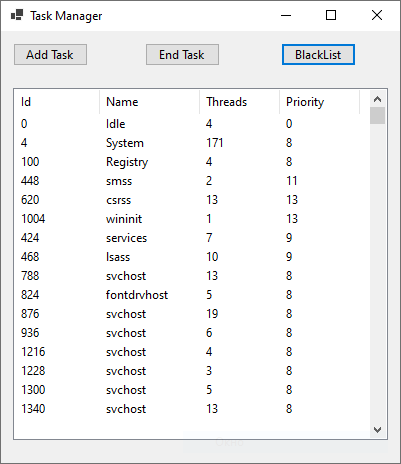

 Используя класс Process создайте таск менеджер.
 - Показывает запущенные процессы (каждые несколько секунд должно обновляться)
 - запускать новый таск
 - остановить таск
 - черный список (процессы которые в списке должны запустится и через некоторое время закрытся)

