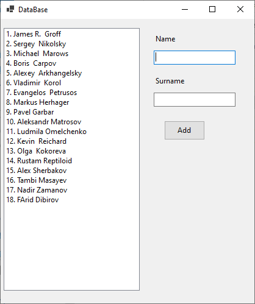

При нажатии кнопки "Создать" создается новый поток и попадает в первый список (список со всеми
созданными потоками). Порядковый номер первого потока равен 1, а каждый последующий поток увеличивается на единицу. Когда вы дважды щелкаете по потоку в этом списке, поток попадает в список ожидания посередине, где он будет оставаться до тех пор, пока вы не освободите любой поток в списке (слева) с работающими на семафоре потоками. Когда любой поток слева завершит свою работу, любой поток из списка ожидания будет добавлен в этот список. Когда вы дважды щелкаете по потоку в списке ожидания, он удаляется из списка и освобождается семафор. Количестово потоков семафора указано счетчиком в левом нижнем углу. Можно уменьшить и увеличить.

