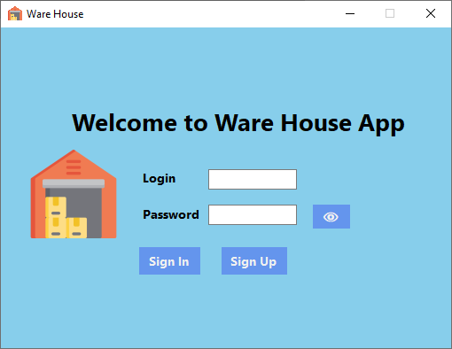

### Проект «Склад»

#### Вся информация должна храниться в файлах.

### Основное меню:
- Client
  * Add
  * List
- Order
  * Accept
  * List
- Product
  * Add
  * List
- Log out
  * Exit
 
Фильтр при написании в списке заказов должны показаться те заказы, которые соответствуют этому фильтру. Например, если написали, «а» тогда покажутся все заказы в которых в имени клиента или продукта есть буква «а», или если ввели «adi» тогда покажутся все заказы в которых в имени клиента или продукта есть частичка «adi».

При добавлении продукта если этот продукт есть количество должно прибавляться, а цена и описание если поменялось и в базе должно меняться.
